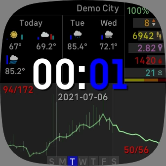

## A Fitbit Sense/Versa 3 face for people who like stats and have good vision.

Welcome to the Hearty McWeatherface documentation! This site is more or less required by Fitbit in order to get access to their web APIs to do things like access sleep and water data. So you can check out our [Terms of Use](./terms) and [Privacy Policy](./privacy) while you're here, but the summary is we don't want your data, we're not responsible for horrible things that happen while you use our software, and we really just want to be able to use all the features of our own watch face, which requires publishing it. This site also serves as a convenient location to describe the features and details of the watch face and its operation, since this face is slightly more complicated than most.

If you're interested in what's changed from version to version, you could check out the commit history or visit the [changelog](./changelog).

### What's with the name?

The two most difficult and common issues related to software development are naming things, cache invalidation, and off-by-one errors. This watch face prominently features heart rates and weather, so taking a page from the name-a-polar-research-ship playbook.

### Features

The watch face is divided into six views, with five of them being more detailed views on a particular subject. Aside from SpO2 details, which aren't currently available, it's the only face we are aware of that exposes nearly every available feature of the Fitbit Sense/Versa 3, and that's only because non-Fitbit developers aren't allowed access to certain newer sensors at this time.

Most of the views that you might want to stay on for more than a few seconds also include the time and current battery charge.

Always on display is also supported, where you'll get the time in outline characters along with the date and heart rate graph over the last thirty minutes. The view shifts randomly every time the display goes off to help avoid burn in.

#### Main view

The main view is fairly dense, informationally speaking. Front and center, you have the time with the date just below. At the top left, you have the weather, including the location name, the next nine hours of forecast from now, and the next two days of forecast. The top right has a summary of stats, including completion levels and a breakdown of active zone minutes. The bottom has three graphs of gathered heartrate data for the last 10 hours, the last 30 minutes, and the last minute and a half. The bottom center shows the current day of the week. The colon between the hour and minute of the time hosts indicators for active stopwatches (top dot) and active timers (bottom dot).

If there is an active exercise, its stats will replace the two days forecast.

Double-tapping on any particular section will open a detailed view for that section's subject. To get to the time view, double tap the time. To get to the heart rate view for a time span, double tap that section of the graph. To get to the detailedstats view, double tap the stats. To get to the detailed weather view, double tap the weather.

If there is an active exercise, double-tapping the exercise stats will go to the exercise view.

### Weather view

The detailed weather view shows the next four days of forecast weather with the next nine hours from now and an earlier and later entry for each of the next three days. The details for each forecast time include the date and hour of the forecast, condition, 'feels like' temperature, percent change of precipitation, temperature, percentage of humidity, wind direction and speed, and percentage of cloud coverage.

At the top of the details table, you will find the forecast city on the left and the time the forecast was fetched on the right.

### Stats view

The detailed stats view shows completion graphs for each of steps, floors, distance, calories, and active minutes. The center of each graph shows the current value. The active minutes graph has an inner graph that shows the percentage of each zone that make up the total time, and the number of minutes in each zone is listed to the right of the graph.

At the bottom right of the view, there is a button to switch to the exercise view.

If you have linked your fitbit account, at the bottom left there is a current water consumption bar, and a button to record water consumption.

### Heart rate view

The detailed heart rate view shows a line graph of the full twenty data points for the selected rainge of data. The main view is somewhat space limited, so if you watch carefully, you'll notice that graphs don't always update at the same time, since they're limited to sixteen or seventeen data points in each section.

Each vertex is labelled with the value that it represents with every other label being under the line. There are also four axis lines that give you an idea of the relative time for each chunk of graph.

### Time view

The detailed time view features two stopwatches and two timers. The stopwatches will count up until you stop them, and the timers will count down until they reach zero. When a timer elapses, it will trigger a vibration and switch to the detailed time view showing which timer just elapsed.

To start a stopwatch, tap it. To stop a stopwatch, tap it. To reset a stopwatch, tap the 'x' button to the right of it while it is stopped.

To start a timer, tap it, set a time on the timer setup view, and tap the check button. Tapping on any of the time sections will increment that section by one. Tapping on any of the other numbers will add the displayed value to the time in that column. Tapping the 'x' button will cancel the timer. To stop a timer, tap it. To reset a timer, tap the 'x' button to the right of it while it is stopped.

### Exercise view

If no exercise is currently active, you can start one from this view. Tap the left and right arrows to get to the exercise you want to start, and then tap the check button. You can go back to the stats screen by tapping the 'x' button.

When an exercise is active, the icon for the exercise appears at top center. The next six hours of weather forecast are shown as the two indicators to the left of the icon. There is a lap button to the right of the icon that, when tapped, will record a lap. It also shows the current lap number.

In the bar below the icon, the active time of the exercise is shown left of the current time and battery percentage.

In the section to the left below the bar are the elevation gained in meters (feet if you are using imperial measurements) and number of steps.

In the section to the right below the bar are the distance travelled and number of calories burned.

The guage in the middle below the bar shows the current kilometer (or mile if imperial) time, with the average for the whole session below.

The guage at the bottom left shows the current speed, with the average speed to the left and the max speed to the right.

The guage at the bottom right shows the current heart rate, with the average to the left and the max to the right. Active zones are also delineated on the guage.

There are two buttons at the bottom that allow you to stop or pause/resume the current session.
